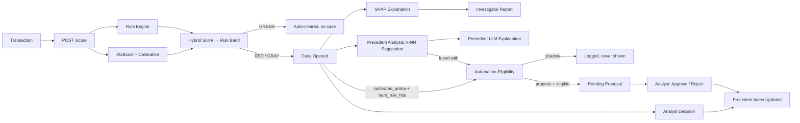
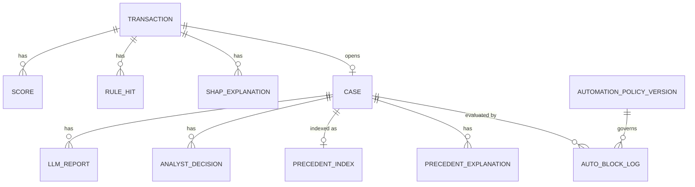

# Fraud Detection & Investigation System

An explainable, human-in-the-loop fraud decision support system: a calibrated XGBoost model scores transactions, SHAP and an LLM explain why, and a precedent-learning layer can *propose* - never finalize - an automated decision.

## Highlights

- **Explainable** - every score carries a SHAP factor breakdown and a plain-English Investigator Report.
- **Calibrated** - raw XGBoost probabilities are badly miscalibrated (Brier skill score **-14.78**); isotonic calibration fixes that (**+0.735**), which is what makes the automation gate's probability threshold meaningful.
- **Three AI layers that recommend, never decide** - Scoring (rules + XGBoost + calibration + SHAP + Investigator Report), Precedent Analysis (k-NN over the analyst's own decision history), and Automation Eligibility (a stricter gate fusing precedent, calibrated probability, and rule hits). The decision form is the only thing that ever closes a case.
- **Human-confirmed automation, not auto-block** - a versioned, six-gate policy can *propose* an action in `propose` mode, but every proposal needs an explicit analyst Approve. A blind shadow-mode measurement and a reject-rate circuit breaker keep that bar evidence-based.
- **Learns from outcomes** - every analyst decision is written back into the precedent index, closing the score → explain → decide → learn loop end to end.
- **A full analyst console** - a searchable/filterable/sortable case queue (7 filters, URL-shareable), a per-case audit trail, a Decision Flow visualization, drag-and-drop dashboard KPIs, and CSV/Excel/PDF export.
- **184 tests** (152 pytest + 32 vitest) across business logic, API invariants, and edge cases, isolated from the live database and real LLM calls. See [Testing](#testing).

## Metrics

Held-out test set, XGBoost vs. a logistic-regression baseline (same leakage-free features, same split, `RANDOM_STATE=42`):

| Model | PR-AUC | ROC-AUC | Precision | Recall | F1 |
|---|---|---|---|---|---|
| LogReg (F1-max) | 0.5650 | 0.9780 | 0.7824 | 0.4598 | 0.5792 |
| Isolation Forest (unsupervised) | 0.0361 | 0.8910 | 0.0548 | 0.4263 | 0.0971 |
| **XGBoost (production)** | **0.8508** | **0.9940** | **0.9021** | **0.7856** | **0.8398** |

**Calibration** (Brier score, lower is better - isotonic regression, validation set `n=554,082`):

| | Brier score | Brier skill score |
|---|---|---|
| Raw XGBoost | 0.0466 | -14.78 |
| **Isotonic-calibrated** | **0.0008** | **+0.735** |

PR-AUC is the primary metric - the 0.30% base rate makes ROC-AUC alone misleading. The Isolation Forest baseline shows why this is a supervised problem, not an anomaly-detection one - see [Baseline Comparison](#baseline-comparison--why-a-supervised-model). Methodology: `scripts/evaluate_model.py`, `scripts/analyze_calibration.py`, `scripts/compare_isolation_forest.py`.

## Architecture

Three AI layers work together, and none finalizes a decision on its own. They fork and fuse rather than chain:

- **Scoring** (the core): a hard/soft rule engine + calibrated XGBoost produce a hybrid risk score and risk band. This feeds **SHAP** (which features drove it) and, from SHAP, the **Investigator Report** (an LLM turns findings into a short analyst report).
- **Precedent Analysis**: branches independently off Scoring alone - a k-NN model over the analyst's own decision history suggests a verdict for similar new cases.
- **Automation Eligibility**: a genuine *fusion* node - it combines Precedent Analysis's output with Scoring's own calibrated probability and rule hits through a stricter, six-gate policy. It can propose a fully automated action, but a human must click Approve before anything closes.

The analyst is informed by all four outputs (score, SHAP, report, precedent) but only ever *mechanically* driven by one path: clicking Approve on an Automation Eligibility proposal. See [Decision Flow](#decision-flow) for how this is visualized, and [Known Limitations](#known-limitations) for why "chain" is the wrong word for it.

| Module | What it does | Key files |
|---|---|---|
| Data & model training | Leakage-free feature engineering, XGBoost fraud model | `scripts/train_models.py`, `scripts/evaluate_model.py`, `models/xgb_v1.pkl` |
| Explainability | SHAP - top contributing factors per transaction | `backend/explain.py`, `scripts/analyze_shap.py` |
| Calibration | Isotonic probability calibration | `backend/calibrate.py`, `scripts/analyze_calibration.py`, `models/xgb_v1_calibrated.pkl` |
| Backend API | FastAPI service, case management, rule engine, hybrid score → risk band | `backend/main.py`, `backend/rule_engine.py`, `backend/scoring.py` |
| Frontend | React analyst console - Overview, Triage, Simulation, Evaluation, Automation Status | `frontend/src/` |
| Investigator Report | Findings → LLM (Groq) → async report; explains, never decides | `backend/findings.py`, `backend/llm_service.py`, `backend/report_worker.py` |
| Precedent Analysis | k-NN over analyst history → suggestion + LLM explanation; recommends, never decides | `backend/precedent.py`, `backend/precedent_worker.py` |
| Automation Eligibility | Six-gate policy → shadow/propose → human Approve/Reject; never auto-finalizes | `backend/automation.py` |

### How a transaction is handled, end to end

1. It arrives at `POST /score` (real traffic, the Simulation screen, or bulk seeding).
2. **Scoring**: XGBoost's calibrated probability is cross-checked against the rule engine to produce a hybrid score → risk band (RED/GRAY/GREEN). GREEN auto-clears with no case; RED/GRAY opens one.
3. **SHAP** explains which features drove the score, and the **Investigator Report** turns that into 2-3 narrated sentences (generated in the background - `/score` never waits on it).
4. **Precedent Analysis** vectorizes the case and compares it via k-NN against every case already decided. Enough close, agreeing precedents → a suggestion; otherwise "insufficient precedent."
5. **Automation Eligibility**, running in parallel, fuses that suggestion with the calibrated probability and rule hits through a stricter six-gate policy. In `shadow` mode this is only measured; in `propose` mode an eligible case gets a pending proposal the analyst must Approve or Reject.
6. **The analyst decides** - informed by all of the above, bound by none of it.
7. **The system learns**: the decision is written back into the precedent pool for the next similar case.
8. Every step is logged and traceable - per-table, or as one chronological view via `GET /cases/{id}/audit-trail` (see [Case-Level Audit Trail](#case-level-audit-trail)).



The two arrows converging on **Automation Eligibility** are the key detail: it's fed by Precedent Analysis *and* by Scoring directly, not by the report or by Precedent Analysis alone - which is why this is a fork/fusion graph, not a chain.

## Setup & Running

```bash
# 1) Clone, then set up the backend virtual environment
python -m venv venv
venv\Scripts\Activate.ps1      # Windows
source venv/bin/activate       # Mac/Linux
pip install -r requirements.txt

# 2) Environment config
cp .env.example .env           # defaults work as-is for local SQLite dev
cp frontend/.env.example frontend/.env
```

**Nothing to train for a fresh clone.** `models/*.pkl` (calibrated XGBoost + scalers, ~200KB total) are committed to the repo. Only retrain if you want to: download the Kaggle "PaySim synthetic financial dataset" into `data/` (gitignored), run `notebooks/01_exploration.ipynb` once, then:
```bash
python scripts/train_models.py
python scripts/analyze_calibration.py
```

**Backend** (FastAPI, repo root, venv active):
```bash
uvicorn backend.main:app --reload --port 8000
```
API docs at `http://127.0.0.1:8000/docs`. First startup creates `fraud.db` (SQLite) and runs schema migrations automatically.

**Frontend** (separate terminal):
```bash
cd frontend
npm install
npm run dev
```
Opens at `http://localhost:5173`, talking to the backend at `VITE_API_URL` in `frontend/.env`.

**Optional - seed demo data, one command:**
```bash
python scripts/setup.py --dry-run   # checks .env, model files, LLM_API_KEY, DB state - writes nothing
python scripts/setup.py --yes       # ~30-45 min, mostly real Groq report generation - needs a real
                                     # LLM_API_KEY (free at console.groq.com/keys)
```
Runs three DB-direct scripts in the one order that's safe on a fresh database. Refuses to run twice on an already-seeded database (`distribute_demo_timestamps.py` isn't idempotent) - use `scripts/clear_demo_data.py --yes` first to reseed.

**The same steps, manually:**
```bash
python scripts/seed_demo_cases.py --yes             # 600 PaySim transactions, real Groq report on every
                                                     # RED/GRAY case, a closed subset for Precedent Analysis
python scripts/distribute_demo_timestamps.py --yes  # one-time, NOT idempotent: spreads created_at across
                                                     # a 30-day window so trend charts have a shape
python scripts/backfill_auto_proposals.py --yes     # evaluates Automation Eligibility for every already-OPEN case

# Optional extras (need the backend running):
python scripts/seed_demo_data.py        # bulk-scores a PaySim sample for background transaction-type volume
python scripts/seed_representative.py   # adds PaySim's full real type distribution
python scripts/backfill_precedents.py   # only needed if models/precedent_scaler.pkl is deleted
python -m scripts.seed_additional_demo --count N        # adds N more PaySim transactions, preserving
                                                         # the DB's current fraud rate
python -m scripts.seed_proposal_candidates --count N    # adds N case-302-profile transactions
                                                         # (TRANSFER+fraud+drain+ghost) - targeted,
                                                         # not random, to grow the automation-proposal pool

# Optional extras (DB-direct, backend NOT required):
python -m scripts.close_open_cases --count N --yes         # closes N open cases via decide_case() to
                                                             # grow the precedent pool
python -m scripts.regenerate_fallback_reports --yes         # replaces fallback llm_reports with real
                                                             # Groq reports - needs a real LLM_API_KEY
```
All four support `--dry-run`; `seed_additional_demo.py` and `seed_proposal_candidates.py` share the same `nameOrig`-exclusion sampling, so neither can duplicate an already-seeded transaction, and `regenerate_fallback_reports.py` is idempotent by construction (a second run finds no `source=fallback` rows left).

**Jupyter kernel** (optional, for `notebooks/01_exploration.ipynb`):
```bash
python -m ipykernel install --user --name fraud-venv
```

## Testing

184 tests (152 backend, 32 frontend), none touching the live `fraud.db` or making a real network call.

```bash
pip install -r requirements-dev.txt
pytest                    # 152 tests - backend

cd frontend
npm test                  # 32 tests - frontend (vitest run)
```

**Backend** (`tests/`, pytest) - `test_rules.py` / `test_scoring.py` unit-test the rule engine and hybrid-score math directly; `test_api_*.py` exercise the same paths through the real FastAPI app (`TestClient`, real model load); `test_automation.py` and `test_precedent.py` cover the gate policy and k-NN logic. Together they cover all three AI layers plus the API surface around them.

**Frontend** (`frontend/src/**/*.test.js`, vitest) - pure logic only: URL query-string construction, `localStorage` order persistence, and small formatting/derivation functions pulled out of components. Component rendering and interaction aren't covered by the automated suite - a scope decision, not an oversight; manual browser verification covers that ground instead.

**Isolation, not assumption:** `tests/conftest.py` redirects `DATABASE_URL` to a fresh temp-file SQLite before any backend module is imported, so `fraud.db` is never touched by the suite. An autouse fixture monkeypatches the real Groq call to raise if it's ever reached, so a misconfigured test environment fails loudly instead of spending API quota.

The suite has caught real regressions - e.g. a missing key in the fast-path branch that would have caused a 500 on `PAYMENT`/`CASH_IN`/`DEBIT` requests.

## Known Limitations

Honest gaps, not hidden ones:

- **`source="live"` doesn't distinguish real traffic from seed data** - both write `source="live"` today. A straightforward fix (a third value) is deferred, not forgotten.
- **Dashboard trend charts show a distributed demo timeline, not real operational history** - dates were assigned after the fact by `scripts/distribute_demo_timestamps.py`, spreading PaySim's `step` field across a fixed 30-day window. Each chart carries a "Demo data · distributed timeline" caption for this reason.
- **Dashboard KPI card order is a per-browser preference (`localStorage`), not a per-user one** - there's no auth system yet for it to belong to. When auth lands, this migrates to a real per-user preference.
- **The demo dataset is seed-heavy by design** - 240 of 247 decisions carry a seed reason code; the rest are this project's own verification writes. This system has never had a live analyst using it in the ordinary sense.
- **Exports (PDF/CSV/Excel) are watermarked as demo data** so the label travels with a file that can be forwarded or filed outside the app.
- **The seed dataset's fraud rate varies by seed composition** - the random-sample scripts preserve PaySim's test-split ratio (~16%), but the targeted `seed_proposal_candidates.py` script adds fraud-only profiles, raising the aggregate above that. The exact rate is a function of which scripts have run; `GET /metrics` is authoritative. In all cases it is deliberately far above PaySim's natural ~0.3%, producing enough RED cases for a working precedent pool and automation surface.
- **The precedent pool includes a synthetic ground-truth-decided batch** (140 cases closed via PaySim's own `isFraud` label, tagged `seed_ground_truth_paysim`), not exclusively real analyst history - needed so a fresh demo isn't stuck at "insufficient precedent" forever. Filter on `analyst_reason_code` to separate the two.
- **CASH_OUT-type RED cases mostly show "insufficient precedent"** - the model rarely reaches RED confidently on that sub-population, so it stays thin regardless of pool size; the similarity gate declining rather than guessing is it working correctly.
- **`errorBalanceOrig` dominates SHAP attribution** (~6x the next-highest feature) - a property of PaySim's clean ledger structure, which may not hold on noisier real-world data.
- **The circuit breaker only watches reject rate**, not post-confirmation reversal - a plausible secondary signal, deliberately not built yet (`reopen_case()`'s reason is free text, not a structured flag).
- **The Groq free tier has a real, finite quota** (~11.6 hours of continuous availability observed empirically) - a large bulk run can exhaust it mid-run. The deterministic fallback path means nothing crashes either way.
- **Trend charts, the audit trail, and report findings are computed live on every request**, not stored as a frozen record - consistent, but with no independent history of their own.
- **The audit trail is a read-only view, not a tamper-evident record** - no write-once storage or hash chaining. A real compliance deployment would add tamper-evidence on top.
- **Decision Flow's automation node reads different data depending on case status** - live gate evaluation for `OPEN` cases, audit-trail events for `CLOSED` ones (see [Architecture](#architecture)).
- **Frontend test coverage is pure logic only** - see [Testing](#testing).
- **Audit trail actors are typed `System`/`AI`/`Analyst`, not real user identities** - there's no auth system yet, so "Analyst" means "whoever used the decision form."

Automation-specific limitations (bias inheritance, exposure-biased vs. blind agreement metrics, the evidence-gated shadow→propose transition) are covered in depth in [Human-Confirmed Automation](#human-confirmed-automation).

---

## Technical Details

### Tech Stack

**Backend** - Python 3.12, FastAPI, SQLAlchemy ORM, SQLite (local development), XGBoost, scikit-learn (logistic-regression and Isolation Forest baselines, k-NN precedent search, isotonic calibration), SHAP (`TreeExplainer`), Groq (`openai/gpt-oss-20b`, swappable) for LLM generation with a deterministic fallback, `xlsxwriter` for Excel export. The backend reads `DATABASE_URL` from `.env`; PostgreSQL is architecturally supported but not configured in this repository.

**Frontend** - React 19, Vite, React Router, Recharts, lucide-react, `html2canvas` + `jsPDF` (PDF export, loaded on demand). Plain CSS with a small design-token system - no UI framework.

**Verification** - 184-test automated suite (see [Testing](#testing)), plus live API calls for anything the suite doesn't cover, `pyflakes` for the backend, `oxlint` + `vite build` for the frontend.

### Project Structure

- `notebooks/` - exploration and modeling notebooks
- `backend/` - FastAPI service and ML logic
- `frontend/` - React + Vite analyst console
- `scripts/` - training/calibration/seeding/analysis scripts, `setup.py` (one-command demo seed), `rescore_hybrid.py` (recomputes stored scores after a formula change - see [Hybrid Score Formula](#hybrid-score-formula))
- `data/`, `models/`, `reports/` - training data (gitignored), trained model weights, output charts (the latter two committed - see [Setup & Running](#setup--running))

### Data Model



- **`transactions`** - every scored transaction: raw PaySim fields + derived model features + five optional "Future Signals" fields (never read by scoring - see Simulation Screen).
- **`scores`** - one row per scoring pass: ML score, rule score, hybrid score, risk band, calibrated probability, model version.
- **`rule_hits`** - every triggered rule: `hard` (fraud-direction, can force RED), `soft` (contributes to the hybrid score), or `clean` (Gate B veto signal only, never shown to an analyst).
- **`shap_explanations`** - per-feature SHAP value, magnitude, and direction.
- **`cases`** - opened only for RED/GRAY transactions; tracks status (`OPEN`/`CLOSED`), priority, timestamps.
- **`llm_reports`** / **`precedent_explanations`** - cached natural-language text, tagged by `source` (`groq` or `fallback`).
- **`analyst_decisions`** - append-only decision history (including reopen/re-decide cycles); what `precedent_index` and the agreement metrics are built from.
- **`precedent_index`** - one vector + label per decided case, the k-NN pool.
- **`auto_block_log`** - one row per automation gate evaluation (`shadow`, `proposed`, `confirmed`, `rejected`, `withdrawn`).
- **`automation_policy_versions`** - every automation policy that has ever been active, append-only.

### API Reference

All request/response bodies are typed with Pydantic (`backend/schemas.py`); the live OpenAPI schema is at `/docs` or `/openapi.json`.

**Scoring & Simulation**

| Method & Path | What it does |
|---|---|
| `POST /score` | Scores one transaction: rules + XGBoost + calibration + SHAP. Opens a case if RED/GRAY. |
| `GET /simulation/templates` | Four starter scenarios for the Simulation screen. |
| `POST /simulation/run` | Scores 1..N transactions through the identical pipeline `/score` uses. |

**Cases**

| Method & Path | What it does |
|---|---|
| `GET /cases` | Paginated, sortable, searchable case queue. Params: `status`, `risk_band`, `q`, `sort`, `order`, `limit` (≤200, default 50), `offset`. Returns `{items, total}`. |
| `GET /cases/filter-options` | Distinct `login_country` values present in the database, for the Triage queue's country filter dropdown. |
| `GET /cases/{id}` | Full case detail - transaction, score, rule hits, SHAP factors, decision history. |
| `POST /cases/{id}/decision` | Records an analyst decision (`confirm_fraud`/`approve_clean`/`escalate`) and closes the case. `analyst_reason_code` is required - see [Precedent Analysis](#precedent-analysis). |
| `POST /cases/{id}/reopen` | Reopens a closed case; prior decisions stay in history. |
| `GET /cases/{id}/report` | The LLM/deterministic case report. `{"status": "generating"}` while pending. |
| `GET /cases/{id}/report-findings` | The raw deterministic findings (SHAP top-5, triggered rules, risk band, calibrated probability) the Investigator Report is built from. |
| `GET /cases/{id}/precedents` | Nearest-neighbor precedents, consensus summary, and its LLM explanation. |
| `GET /cases/{id}/pending-ai-decision` | Whether a pending automation proposal exists (`null` if not). |
| `POST /cases/{id}/confirm-ai-decision` | Approves a pending proposal - the only way one becomes a real decision. |
| `POST /cases/{id}/reject-ai-decision` | Rejects a pending proposal (`rejection_reason` required); case stays open. |
| `GET /cases/{id}/automation-gates` | All six gates and where this case stands on each, for any OPEN case. `null` for CLOSED. |
| `GET /cases/{id}/audit-trail` | Every recorded event for this case, chronological, with observational anomaly flags. |
| `GET /cases/export` | The Triage queue's filtered result as a downloadable file. `format=csv` or `format=xlsx`. |

**Model, Metrics & Automation**

| Method & Path | What it does |
|---|---|
| `GET /model-info` | Training metadata, calibration stats, baseline model comparison. |
| `GET /metrics` | Dashboard KPIs - scored/case counts, pending proposal count, active automation mode. |
| `GET /metrics/trends` | Day-by-day series for the dashboard's trend charts. |
| `GET /automation/status` | Active policy, shadow-agreement stats, reject rate, gate-bottleneck breakdown, bias monitoring, circuit breaker state. Every count is paired with the case_ids behind it. |

### Key Principles

PR-AUC is the primary metric; synthetic fields never enter the model; the LLM never makes decisions; there is no fully automatic block.

### Analyst Console (Frontend)

A React + Vite single-page app - five screens behind a persistent deep-teal sidebar with grouped navigation, a dark-mode toggle, and an analyst identity chip, all reading from the API above. A dark-mode toggle (`localStorage`-persisted) switches the content area between light and dark themes; the sidebar retains its teal palette in both modes.

| Screen | Route | Purpose |
|---|---|---|
| Overview | `/` | Landing page - four drag-and-drop KPI cards with pastel icon badges (Scored Transactions, High-Risk RED, Open Cases, Pending AI Proposals), a donut chart for risk-band distribution, trend charts, and a priority queue. |
| Triage | `/triage` | Case queue and case detail in one split view. **Queue**: filterable/searchable/sortable (7 filters, URL-synced), with CSV/Excel export. **Detail**: score, SHAP, rules, Investigator Report, Precedent Analysis suggestion, any pending automation proposal, a decision form (Reason Code required), decision history, Case Timeline, Audit Trail, Decision Flow, PDF export. Deep-linkable (`/triage?case=182`). |
| Simulation | `/simulation` | Build or bulk-generate transactions and score them live. |
| Evaluation | `/evaluation` | Model metrics, calibration, and baseline comparison - training-time numbers, flagged as not live performance. |
| Automation Status | `/automation` | Active policy thresholds, shadow-agreement rate, reject rate, gate-bottleneck breakdown, circuit breaker state, bias monitoring. |

`GET /cases` does filtering/sorting/searching in SQL and returns one page at a time - the frontend only ever holds 50 rows in memory, even at this demo's 634-open-case scale. The same endpoint backs both Overview's "top 5 by risk" and the full Triage queue.

### Simulation Screen

Lets an analyst build or bulk-generate transactions and watch the model score them live, without a real transaction feed.

- `GET /simulation/templates` - four starter scenarios that pre-fill the form.
- `POST /simulation/run` - takes `{transaction, count}`, scores through the exact same pipeline `/score` uses.
- **This is the production path, not a sandbox** - a simulated transaction can open a real case and generate a real report; only `source=simulator` distinguishes it from live traffic.
- **A single-transaction run shows all case-detail layers live** - Investigator Report, Precedent Analysis, and Automation Eligibility, plus a direct link into the real case.
- Every simulated transaction is tagged `source="simulator", is_demo=True`, filterable without touching how real transactions are scored.
- **No label leakage** - the simulator never accepts or sends `isFraud`; whether a case is flagged is entirely up to the model + rule engine.
- **"Future Signals" panel** - five optional fields (`device_id`, `is_known_device`, `login_country`, `geo_velocity_flag`, `channel`) an analyst can set, styled distinctly and captioned as illustrative - they demonstrate the architecture's extensibility but are verified never scored (checked across `scoring.py`, `rule_engine.py`, `precedent.py`; confirmed live that identical inputs with these fields varied produced bit-identical scores).

### LLM-Generated Case Reports

Every RED/GRAY case gets a short natural-language report, generated in the background and always available even with no LLM configured.

**Flow:** `findings → LLM → async storage → query`
1. **Findings** (`backend/findings.py`) - a deterministic function turns SHAP top-5, triggered rules, risk band, and calibrated probability into short factual sentences. A fully valid report on its own.
2. **LLM** (`backend/llm_service.py`) - a provider-abstract interface; the prompt allows only the given findings, never invented facts. On any failure (no key, rate limit, timeout), it falls back to the findings text with `source="fallback"` - nothing crashes.
3. **Async storage** (`backend/report_worker.py`) - runs in a background task after the response is already sent, so `/score` latency is unaffected. Idempotent - generated at most once per case.
4. **Query** - `GET /cases/{id}/report` returns `{"status": "ready"|"generating", ...}`. Case Detail polls every 2s, up to 10 tries, then shows a "refresh to check" message.

**The LLM's role is explanation, not judgment (see Highlights)** - risk band, hybrid score, and calibrated probability all come from the rule engine + XGBoost + calibration pipeline, unchanged by this layer. The LLM only rephrases the same findings the fallback text is built from.

**`.env` variables:**
```
LLM_PROVIDER=groq              # only "groq" is implemented; anything else always falls back
LLM_API_KEY=                   # blank = fallback-only, no external calls, no key required
LLM_MODEL=openai/gpt-oss-20b   # any Groq-hosted model works
```

**Source badges** on Case Detail show where a report came from: a blue "✨ AI-generated" badge for a real LLM response, or a neutral gray "Auto-summary" badge for the fallback - styled neutrally, not as a warning, since it's a fully valid report either way.

### Hybrid Score Formula

`rule_engine.compute_hybrid_score()` turns the calibrated probability and the rule engine's findings into `hybrid_score` (0-100), which drives `risk_band`. Three paths reach RED:

| Path | Trigger | Formula |
|---|---|---|
| Hard rule | `ghost_destination` fired | `min(100, max(85, ml_score) + 0.13 * soft_score)` |
| Weighted (no rule) | `0.70·ml_score + 0.30·soft_score >= 85` | `min(100, 0.70·ml_score + 0.30·soft_score)` |
| High-confidence override | no hard rule, weighted score < 85, `calibrated_proba >= 0.95` | `85 + 5 · (weighted_score / 85)` |

The hard-rule path adds a soft-score term (`_SOFT_CONTRIB = 0.13`) because the original `max(85, ml_score)` formula piled every hard-rule case onto a narrow 85.0–87.2 band regardless of how much additional evidence fired - sorting the RED queue by risk stopped meaning anything. `0.13` was chosen by testing alternatives against the live population of hard-rule cases: it spreads the full observed soft-score range across the headroom above 85 without ever exceeding 100.

The high-confidence override needed a different fix (rescaling into `[85, 90]` rather than adding the same term) so a probability-only promotion ranks below a rule-backed one instead of colliding with it at the same value.

**Verified on the live dataset**: RED now spans 85.0–99.55 across 36 distinct values (was 85.0–87.2 across 11), with zero `risk_band` changes - every case that was RED stayed RED; the fix only redistributes ranking *within* the band. `scripts/rescore_hybrid.py` recomputes both paths whenever this formula changes again - dry-run by default, and refuses to write if it detects a `risk_band` change.

### Precedent Analysis

**Recommends only (see Highlights).** It learns from the analyst's own decision history and surfaces similar past cases as context; the decision form is unchanged and is the only thing that ever closes a case. Automatic action on a suggestion is a separate, stricter layer - see [Human-Confirmed Automation](#human-confirmed-automation).

**How it learns:**
1. **Vectorize** (`backend/precedent.build_case_vector()`) - the same six model features XGBoost/SHAP use plus a risk-band one-hot, scaled with a `StandardScaler` fit once and persisted (`models/precedent_scaler.pkl`) - no leakage, no drift.
2. **Index** - only `CLOSED` cases are eligible; each stores its vector + the analyst's decision as `label`. Reopening leaves the entry untouched until the case is genuinely re-decided.
3. **Query** (`backend/precedent.find_precedents()`) - `sklearn.neighbors.NearestNeighbors(metric="cosine")`, k=15, self-exclusion applied before fitting.

**Confidence gates** - all pure arithmetic, no LLM: a similarity floor (0.5) excludes barely-related neighbors from voting at all, and a suggestion only exists when `precedent_count >= 5`, `avg_similarity >= 0.85`, and `consensus_ratio >= 0.70` all hold. Any gate failing → "insufficient precedent - use judgment." `escalate` is a valid first-class suggestion, though it can never become an automatic action.

**Reason codes** - every manual decision requires a non-blank `analyst_reason_code`, paired in the UI with an 18-code grouped combobox (free text also accepted). This feeds `common_patterns` and `common_reason_codes` in the precedent summary - both currently near-empty, since the demo database is 97% seed-tagged and PaySim carries no real reason-code ground truth to backfill from honestly. It fills in as real analysts use the combobox.

**The LLM's role** - `explain_precedents()` turns the deterministic summary into 2-3 sentences, given only that summary, never raw transaction data. No suggestion means no LLM call at all.

**Cold start** - an empty precedent index or missing scaler means every code path stays silent rather than crashing: `GET /cases/{id}/precedents` returns "insufficient precedent," and decisions still record normally.

**Bias limitation** - Precedent Analysis imitates the analyst; it does not audit the model, the rules, or the analyst. A suggestion is a plurality vote over past calls - a systematic bias in those calls is learned and reproduced with the same confidence as a genuinely good pattern. This is why the layer stops at a suggestion and a human stays in the loop.

**Agreement metric** - `backend/precedent.compute_agreement_stats()` is implemented and tested but not wired to any endpoint or shown in the UI (unlike the live "Shadow Agreement" card under Automation Status, which measures something related but distinct). Documented here for when it is wired up: it computes agreement two ways - `retrospective=False` uses the suggestion recorded at decision time (an upper bound, inflated by exposure, since a visible suggestion can nudge the analyst toward it); `retrospective=True` recomputes against today's grown pool, answering a different question. Only a blind/shadow measurement (see Human-Confirmed Automation) is unbiased.

### Human-Confirmed Automation

**No decision ever finalizes without a human clicking Approve.** This is a second, stricter gate on top of the precedent suggestion: deterministic, versioned, logged, and never self-executing.

**Staged rollout - `off → shadow → propose`, no "full-auto":**
- **`off`** - nothing evaluated, nothing logged.
- **`shadow`** - every decided case is evaluated and logged, never surfaced to the analyst. This is how evidence accumulates before automation is trusted with anything visible.
- **`propose`** - an eligible, fraud-direction case gets a pending proposal in Case Detail, requiring explicit sign-off.

**The six gates** (`backend/automation.py`, pure arithmetic, no LLM):
1. Direction is automatable (fraud only - see Asymmetry below).
2. `avg_similarity >= 0.95`
3. `precedent_count >= 10`
4. `consensus_ratio >= 0.90`
5. `calibrated_proba >= 0.95` - the independent check that the precedent consensus and the model's own probability agree.
6. Hard-rule conflict check - fails unconditionally if Precedent Analysis says "fraud" while a `clean_confirmed` rule also fired for the same transaction.

Every threshold is read from the active, versioned policy, never hardcoded. Two policy versions exist to date: v1 shipped in `shadow` mode; v2 switched to `propose` after measuring that 9 of the then-271 open cases cleared all six gates - the counts have since grown with additional seeding (`GET /automation/status` is authoritative for current figures). The blind shadow measurement since: 140 evaluations, 2 eligible, both of which the analyst's actual decision would have confirmed correctly - a start, not a claim of reliability at scale.

**Asymmetry - only fraud is ever proposed.** `approve_clean` is blocked unconditionally by policy (auto-clearing carries a different risk profile than a delayed review); `escalate` is blocked with no override, since escalating already means "send this to a human."

**The confirmation mechanism:**
- `POST /cases/{id}/confirm-ai-decision` - the only way a proposal becomes a real decision; `auto_processed` stays `False` always, because a human processed it.
- `POST /cases/{id}/reject-ai-decision` - requires a reason; the case stays open for the analyst's own decision.
- Doing nothing leaves the proposal pending indefinitely - no timeout, no default action.

**Rubber-stamping monitoring** - the reject button carries the only UI friction (a mandatory reason), so declining stays genuinely easy; `reject_rate_stats()` reports `None` below a minimum sample size rather than a meaningless percentage; every count on Automation Status is click-to-reveal down to the exact case_ids behind it.

**Circuit breaker** - `check_circuit_breaker()` compares the active policy's reject rate against its threshold right after each rejection; if tripped, it automatically downgrades `propose` back to `shadow`, logging why. It only downgrades mode, not thresholds - a human decides those before re-enabling `propose`. Watches reject rate only, not post-confirmation reversal (see Known Limitations).

**Policy versioning** - every threshold change is a new row, never an edit in place, so a proposal stays permanently bound to the exact policy version that produced it.

**Bias limitation (inherited, not resolved)** - this gate is stricter than the plain suggestion but still learns from analyst decisions, not ground truth; a systematic bias clears the higher bar just as confidently as a well-calibrated pattern. `bias_monitoring_stats()` is a minimal smoke-check (confirmed/rejected by transaction type), an alarm bell, not a certification.

**Shadow vs. suggestion agreement** - these sound similar but differ: suggestion agreement is exposure-biased (the analyst could see it while deciding); shadow agreement is computed and logged but never shown before the decision - the only one that's a legitimate blind comparison.

#### Conscious limits (backlog, not gaps left unmentioned)

- **Reversal-rate signal** - not implemented; `reopen_case()` needs a structured flag before it could be a reliable secondary circuit-breaker trigger.
- **Shadow-to-propose is evidence-gated, not evidence-complete** - the mechanism is proven end to end; today's shadow sample size alone doesn't justify flipping to `propose` in a live deployment, and that gating is intended, not an oversight.
- **Circuit breaker thresholds** (`max_reversal_rate=0.20`, `min_confirmations=5`) are reasonable starting points, not values validated against real production volume - they're policy fields specifically so they can be revised without a code change.

### Export

- **CSV** (`GET /cases/export?format=csv`) - every row matching the current Triage filters, with a `source` column (`demo`/`live`/`simulator`) on every row.
- **Excel** (`?format=xlsx`) - the same filtered rows as a two-sheet workbook with a risk-band chart and a demo-data banner.
- **PDF** (Case Detail's "Export PDF") - a single case, captured client-side, with a demo-data banner baked into the document itself and interactive elements hidden from the capture.

All three reuse the same filter logic `GET /cases` uses, so an export can never silently disagree with what the analyst was looking at.

### Case-Level Audit Trail

`GET /cases/{id}/audit-trail` assembles every recorded event for one case into a chronological timeline - scoring, report generation, precedent indexing, automation proposal/review, and every decision - read-only, computed live.

Each event carries `actor: "System" | "AI" | "Analyst"` and optional `anomaly_flags` - **observations, not verdicts**: `ai_human_conflict` (went against an AI suggestion), `no_reason` (a manual decision with no reason code or note), `rapid_redecision` (two decisions within 60 seconds). A flag means "worth a second look," never "this was wrong."

`actor: "AI"` means "the automated system layer," not "an LLM wrote this" - each event's `detail` says explicitly whether an LLM was involved.

Shadow-mode evaluations are deliberately excluded from the trail (surfacing them would break the blind-measurement guarantee). This is distinct from the smaller **Case Timeline**, a fixed 3-step lifecycle summary - the Audit Trail is the complete, flag-annotated log. See [Known Limitations](#known-limitations) for why this is a view, not a tamper-evident record.

### Decision Flow

A summary visualization on Case Detail (`DecisionFlow.jsx`) of every layer's current state for one case, each step clickable to jump to its detail card. It renders no data of its own - every value is re-derived from what the page already fetched.

Its layout follows the real dependency graph from [Architecture](#architecture): Score branches to SHAP → Investigator Report on one path and directly to Precedent Analysis on another; both, plus Score's own calibrated probability and rule hits, converge on Automation Eligibility (drawn with a distinct "merge" connector). The human node is styled as mechanically driven only when the decision actually came from clicking Approve - every other path is "informed by," not "produced by."

For a `CLOSED` case, the Automation Eligibility summary falls back to the audit trail's own automation events, since that endpoint is OPEN-only.

### Performance

`POST /score` end-to-end latency (feature prep → XGBoost → rules → SHAP → calibration → DB write; the async LLM report is excluded). Measured with `scripts/measure_latency.py`, N=150, after a 10-request warm-up:

| | avg | median | p95 | p99 |
|---|---|---|---|---|
| Run 1 | 121.0 ms | 94.3 ms | 282.2 ms | 470.3 ms |
| Run 2 | 113.1 ms | 103.8 ms | 201.6 ms | 420.0 ms |

Faster than the 143 ms reference-paper benchmark this is compared against. The wider tail reflects SQLite's single-writer lock on a single dev process, not the scoring pipeline - a connection-pooled database (e.g. PostgreSQL) would not serialize writes this way.

### Baseline Comparison - why a supervised model

`scripts/compare_isolation_forest.py` adds an unsupervised Isolation Forest baseline on the same split as the production model. Its precision (5.48%) is far below usable - with no access to labels, it flags transactions as anomalous purely on how unusual their raw values are, which large *legitimate* transfers also produce. Its ROC-AUC (0.891) shows it ranks fraud better than random, but PR-AUC and top-of-ranking precision - what matters at a 0.30% base rate - are poor. This is the concrete case for the supervised approach here.

### Current State

*A live system's row counts move with every decision - treat this as a point-in-time snapshot; `GET /metrics` and `GET /automation/status` are authoritative for the current state.*

```
transactions:               1251   (1250 demo/simulator-seeded, 1 pre-existing live baseline - one
                                    row over the 1250 target: scripts/seed_additional_demo.py sent
                                    exactly 149 requests, but an external POST /score landed during
                                    its ~16-min run window and was swept in by its own by-ID demo-
                                    tagging cutoff, which tags everything newer than a captured max
                                    ID regardless of who sent it)
cases:                       877   (243 CLOSED, 634 OPEN)
precedent_index:             244   (unchanged - new cases from this run are OPEN, not yet indexed)
analyst_decisions:           247   (unchanged - no new decisions from this run)
llm_reports:                 877   (876 groq, 1 fallback - fallback count did not increase)
precedent_explanations:      114
auto_block_log:              195   (140 shadow · 54 pending · 1 confirmed)
automation_policy_versions:    2   (v1 shadow default; v2 the live shadow→propose switch, active)
```
